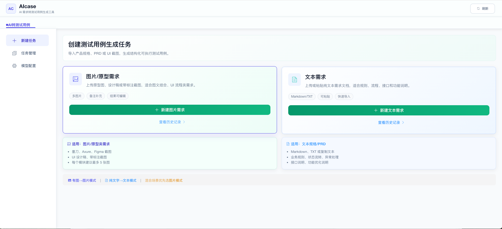
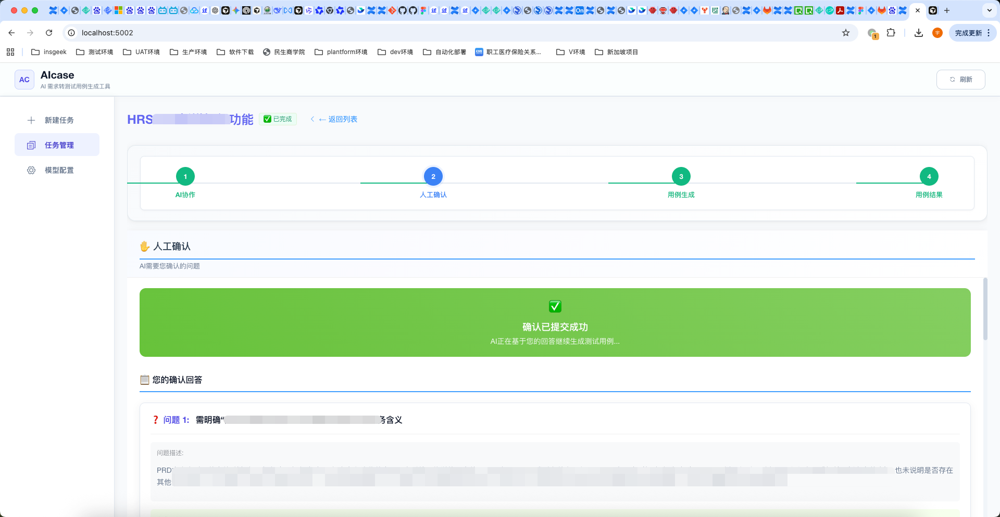

# AIcase

AIcase 是一个面向 QA、测试开发、产品和研发团队的生产级 AI 测试用例生成平台，可以把 PRD、需求文档、产品规格说明、原型图、设计稿、业务截图等输入，转换为结构化、可执行、可导出的测试用例。

可直接进入测试设计、用例评审和回归测试准备流程。

它也不是简单的“让大模型写用例”：系统会先审查需求缺口和逻辑不闭环问题，再通过人工确认补齐事实，生成用例。

成本也足够低：按当前推荐配置，即使用高质量模型组合，常见单任务成本约 1-2 元。

## 界面预览





## 功能

- 文本需求导入：支持粘贴或上传 PRD/需求说明。
- 图片需求导入：支持上传原型图、设计稿、截图和补充备注。
- 人工确认：对需求缺口、逻辑不闭环或关键信息缺失进行一次性确认。
- 测试用例生成：覆盖普通模块用例和跨模块链路用例。
- 结果导出：支持在页面查看并下载 Excel/JSON。
- 模型配置：页面内配置不同阶段使用的模型，并可测试连通性。

## 技术栈

- Backend: Flask, SQLAlchemy, SQLite
- Frontend: Vue 2, Element UI
- Workflow: LangGraph
- Model Config: OpenAI-compatible

## 快速开始

### 一键启动

```bash
git clone git@github.com:fengyu9958123-rgb/Asura.git
cd aicase
bash scripts/quick-start.sh
```


脚本支持 Ubuntu 20.04/22.04/24.04 等主流 Ubuntu 系统和 macOS。Ubuntu 缺少 Docker 时会自动安装 Docker Engine 与 Docker Compose 插件；macOS 需要 Docker Desktop。

访问：

```text
http://localhost:5002
```

首次启动后可在页面“模型配置”中维护模型，也可以直接编辑 `runtime/config/OAI_CONFIG_LIST` 后重启容器。

测试用例生成质量强依赖模型能力。首次进入页面后，建议先打开“模型配置”，按下面三类用途填好模型并点击“测试”确认连通性：


| 用途              | 推荐模型                                  | 作用                                           | 选型建议                                               |
| ----------------- | ----------------------------------------- | ---------------------------------------------- | ------------------------------------------------------ |
| 需求拆分模型      | GPT-5.5 或同等级/更强模型                 | PRD 分块、LU 拆分、跨模块链路识别              | 这一步决定后续上下文是否完整，建议使用最新一代顶级模型 |
| 需求/测试用例模型 | DeepSeek V4 Pro 或同等级/更强模型         | 需求审查、确认整合、最终 PRD、测试用例生成     | 调用量最大，建议使用国内一线模型兼顾质量和成本         |
| 图片分析模型      | Doubao Seed 2.0 Pro 或同等级/更强视觉模型 | 原型图、设计稿、截图、箭头备注和文件名语义提取 | 图片需求必须配置，视觉理解弱会直接造成需求遗漏         |

费用参考：按当前推荐配置，常见单任务约 1-2 元。实际费用取决于模型、需求长度和图片数量，页面“AI 协作运行”会展示任务估算费用。

如果只想先体验页面，可以先查看内置示例任务；如果要生成自己的高质量用例，请先完成以上模型配置。

### 本地开发

```bash
# 克隆仓库项目
git clone https://github.com/fengyu9958123-rgb/Asura.git
# 切换工作目录 进入项目根目录
cd 你的项目路径
# 创建 Python 虚拟环境 使用 venv 模块在当前目录下创建一个名为 .venv 的虚拟环境，用于隔离项目依赖，避免污染系统 Python 环境。
python3 -m venv .venv
# 激活虚拟环境 在 macOS / Linux 下激活虚拟环境。激活后，终端提示符前会显示 (.venv)，并且后续的 python、pip 命令都将使用该环境下的版本
source .venv/bin/activate
# 安装项目依赖 根据 requirements.txt 文件中列出的包名和版本，一次性安装项目所需的所有第三方库。
pip install -r requirements.txt
# 执行模型配置库
cp config/OAI_CONFIG_LIST.example config/OAI_CONFIG_LIST
# 初始化数据库
python database/init_db.py init
# 执行项目启动脚本
./start.sh
# 访问地址浏览器打开
http://localhost:5002
```

## 文档

- [部署说明](docs/DEPLOYMENT.md)
- [图文使用手册](docs/USER_MANUAL.md)

## 目录

```text
agents/       Agent 定义和提示词模板
config/       模型配置示例
database/     数据库模型和初始化脚本
routes/       Flask API
services/     核心业务、LangGraph 流程、文件服务
static/       前端静态资源
templates/    页面模板
docs/         开源文档
```

## 本地数据

运行过程中会产生配置、上传文件、日志和导出结果。Docker Compose 默认写入 `runtime/`，本地开发默认写入项目下的运行目录：

- `config/OAI_CONFIG_LIST`
- `data/`
- `logs/`
- `outputs/`
- `uploads/`
- `runtime/`

## License

MIT

## 开发者的话

AIcase 的目标不是替代人工，而是把真实需求、人工确认和模型能力结合起来，让测试用例生成更高效、风格统一。现实里的 PRD、截图和业务说明很少天然完整，所以保留人工确认是必要的，AI 更适合做整理、补全和结构化。

没有把企业知识库或 RAG 放进主链路，是因为包袱太重，知识库本身质量不好反而适得其反。

## 联系与反馈

- Issues：GitHub / Gitee 仓库 Issues

