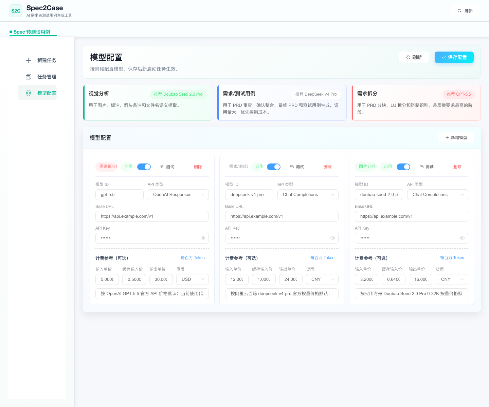
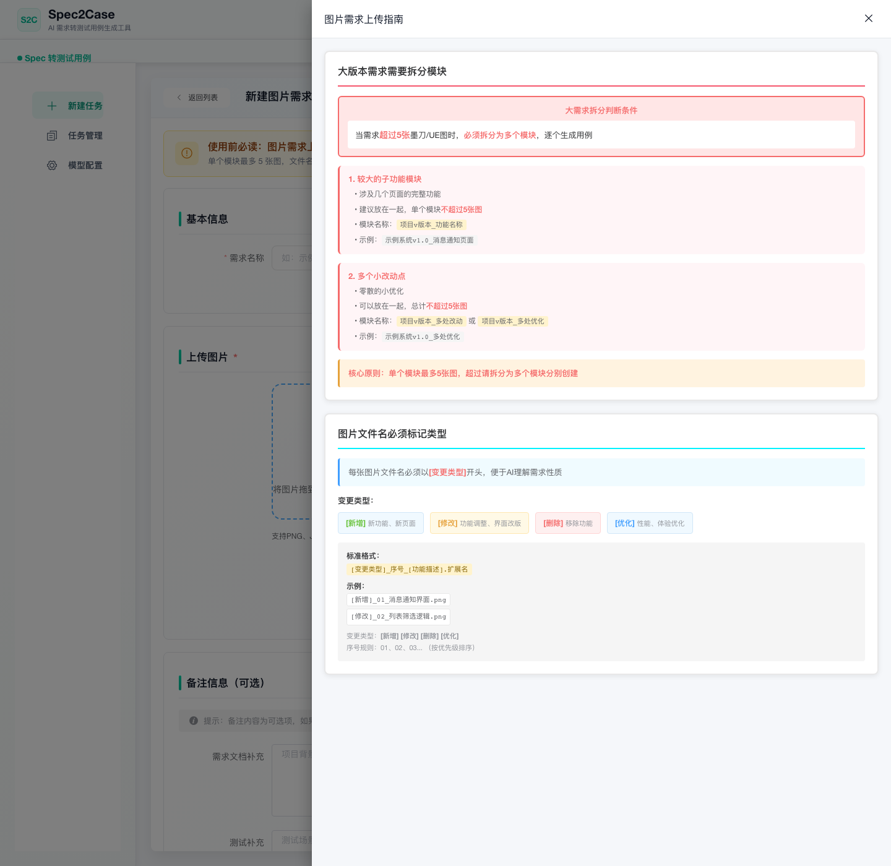
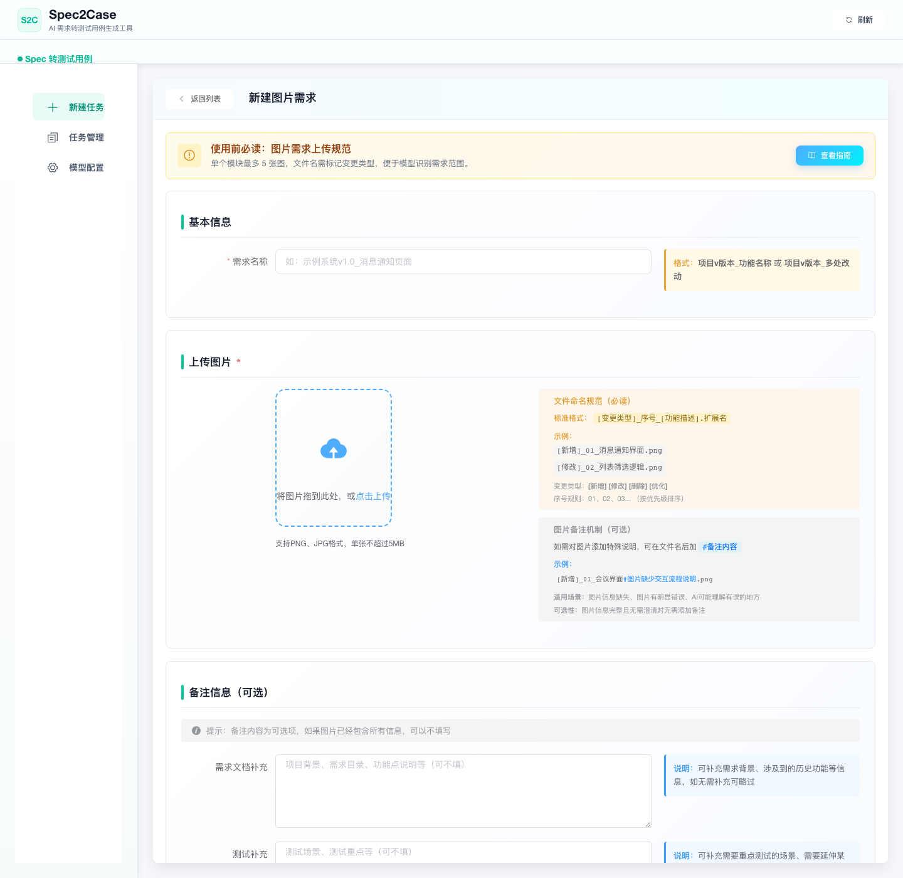
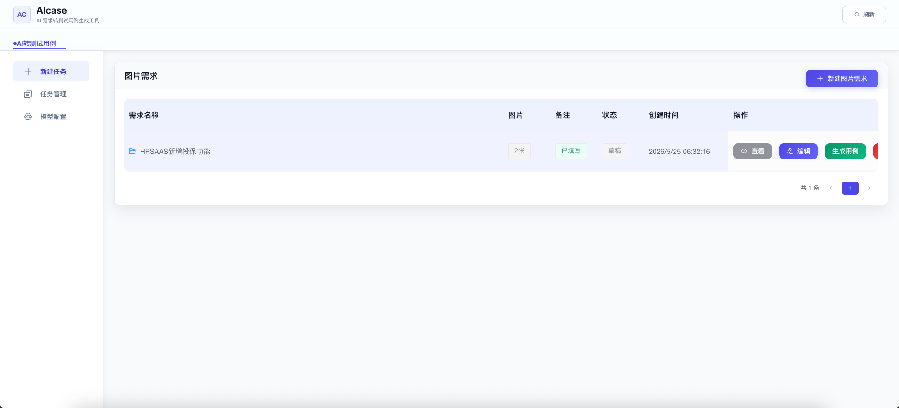
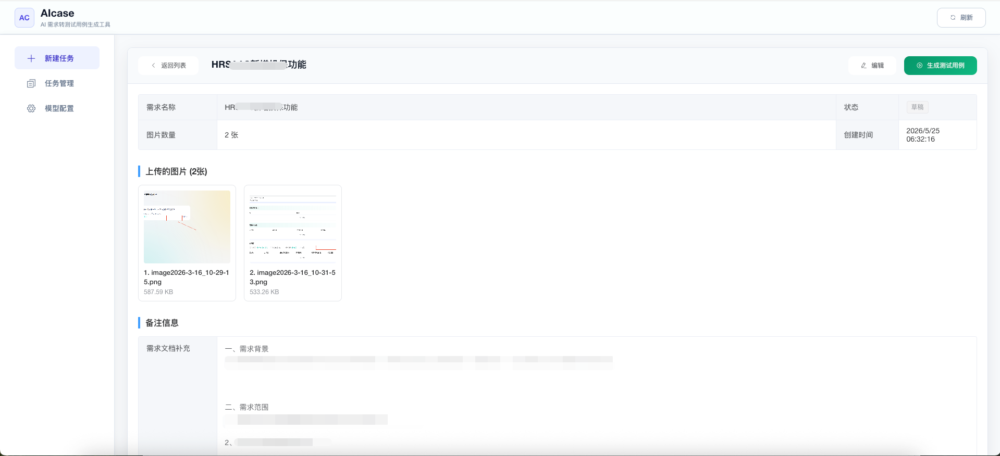

# Spec2Case 图文使用手册

这份手册面向部署完成后的使用者，示例截图使用脱敏图片任务，不包含真实业务信息。

## 1. 打开系统

访问部署地址后进入首页。左侧是主要功能入口：新建任务、任务管理、模型配置。


## 2. 配置模型

第一次使用前，先进入“模型配置”，按三类用途填写模型并逐项点击“测试”。



- 需求拆分模型：推荐 GPT-5.5 或同等级/更强模型，用于 PRD 分块、LU 拆分和链路识别。
- 需求/测试用例模型：推荐 DeepSeek V4 Pro 或同等级/更强模型，用于需求审查、确认整合、最终 PRD 和测试用例生成。
- 图片分析模型：推荐 Doubao Seed 2.0 Pro 或同等级/更强视觉模型，用于图片、标注、箭头备注和文件名语义提取。

高质量测试用例生成对模型能力要求较高。如果只是体验系统，可以先查看内置示例任务；如果要处理自己的需求，建议先完成模型配置。

## 3. 新建图片需求

点击“新建任务”，选择“新建图片需求”。图片需求适合原型图、设计稿、业务截图、带标注截图等输入。



进入创建页后，系统会弹出上传指南。建议按功能模块拆分图片，单个模块最多 5 张图。

关闭指南后，可以填写需求名称、上传图片，并补充需求说明或测试重点。



图片文件名建议带上变更类型、序号和功能描述，例如：

```text
[新增]_01_消息通知界面.png
[修改]_02_列表筛选逻辑.png
```

如果图片无法表达完整需求，可以在“需求文档补充”里写背景、业务规则或页面关系；如果有测试重点，可以写在“测试补充”里。

## 4. 查看图片需求列表

保存后，可以在图片需求历史列表中查看任务状态、图片数量和操作入口。



常见操作：
- 查看：进入详情页。
- 编辑：调整图片、需求名称和备注。
- 生成用例：启动图片需求生成流程。
- 删除：删除草稿任务。

## 5. 查看图片需求详情

详情页会展示需求名称、状态、图片数量、上传图片和备注信息。



确认内容无误后，可以点击“生成测试用例”。生成过程中如果系统发现需求缺口或图片信息不明确，会进入人工确认。

## 6. 人工确认

人工确认用于补齐原始图片和备注中没有明确说明的内容。

填写建议：
- 直接写明确结论。
- 不要只写“按默认”。
- 尽量补充规则、边界条件、异常处理和状态流转。

人工确认结果会成为最终需求事实，后续测试用例会基于图片分析、备注和人工确认一起生成。

## 7. 查看结果和 AI 协作

任务完成后，可以进入任务详情查看：
- AI 协作流程
- 节点输入输出
- 人工确认结果
- 最终需求
- 测试用例
- token 和大概费用

AI 协作区用于排查生成过程，如果结果有偏差，可以通过节点输入输出定位是哪一阶段产生了问题。

费用参考：按当前推荐配置，常见单任务约 1-2 元。实际费用取决于模型、需求长度和图片数量。

## 8. 文本需求

如果输入是纯文本 PRD、需求说明、业务规则或接口说明，可以在“新建任务”中选择“新建文本需求”。文本流程和图片流程类似，也会经过需求审查、人工确认、最终 PRD 整合和测试用例生成。

## 9. 导出结果

任务完成后，结果支持在线查看并导出：
- Excel
- JSON

Excel 适合直接进入测试评审和执行；JSON 适合二次集成到内部平台。

## 10. 使用建议

- 图片需求尽量使用清晰文件名。
- 超过 5 张图的大需求建议拆分为多个图片需求。
- 备注只补充图片没有表达清楚的内容，不需要重复描述图片上已经清楚展示的信息。
- 人工确认要写明确结论，因为它会被纳入最终需求事实。

## 11. FAQ

**为什么需要人工确认？**  
真实需求很少天然完整。人工确认是把歧义、缺口和边界补成可执行事实的最后一道质量闸门。

**为什么没有把企业知识库放成主链路？**  
知识库适合补背景，不适合做最终事实源。主链路必须以原始需求、图片事实和人工确认结果为准。

**AI 能不能替代人？**  
不能完全替代。AI 适合整理、归纳和扩展，人负责最终确认和拍板，这样质量更稳定。
